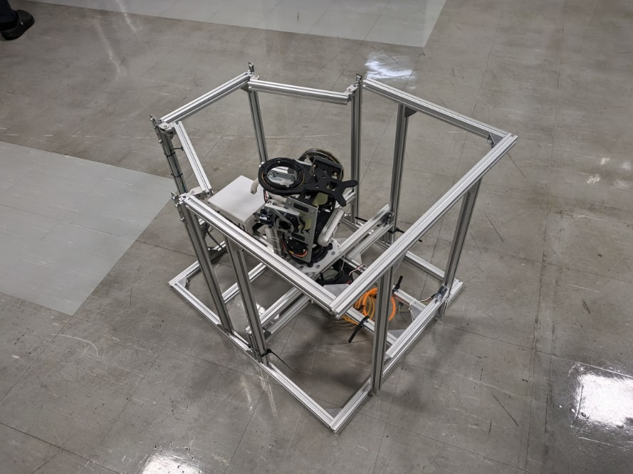

# CoRE AutoRobot 2024 general
CoRE-1 2024　自動ロボットに関する情報をまとめています．
- [Raspberry Piのファームウェア](https://github.com/scramble-robot/CoRE_AutoRobot_2024_raspberrypi)
- [サンプルプログラム](https://github.com/scramble-robot/CoRE_AutoRobot_2024_sample)
- [CADデータ](https://a360.co/3MP85G7)

# SPEC
## サイズ
- 通常時
    - W550 *D670 *H1000


- 輸送時
    - W550 *D650 *H500




## 使用カメラ
- [Realsense D455](https://www.intelrealsense.com/depth-camera-d455/)
- ロボット視点イメージ

    [](https://www.youtube.com/watch?v=nvyRWckMJ-0)

## Pitch軸
- 可動域
    - +30deg～-10deg
- 駆動モータ
    - [GM6020](https://store.dji.com/jp/product/rm-gm6020-brushless-dc-motor?vid=48421)（ESC内蔵）
        - [データシート](https://www.mouser.com/datasheet/2/744/RoboMaster_GM6020_Brushless_DC_Motor_User_Guide-1551074.pdf)
    - タイミングベルトで1:3に減速
## Yaw軸
- 可動域
    - +80deg～-80deg
- 駆動モータ
    - [GM6020](https://store.dji.com/jp/product/rm-gm6020-brushless-dc-motor?vid=48421)（ESC内蔵）
        - [データシート](https://www.mouser.com/datasheet/2/744/RoboMaster_GM6020_Brushless_DC_Motor_User_Guide-1551074.pdf)
    - タイミングベルトで1:2に減速
## 射出ローラー
- 回転数
    - 0rpm～6500rpm（ルール上の制約により）
- 駆動モータ
    - [M3508](https://store.dji.com/jp/product/rm-m3508-p19-brushless-dc-gear-motor?vid=32501)（ESCに[C620](https://store.dji.com/jp/product/rm-c620-brushless-dc-motor-speed-controller?vid=32491)を使用）
        - [C620データシート](https://www.mouser.com/datasheet/2/744/RoboMaster_M3508_P19_Brushless_DC_Gear_Motor_V1.0-1551061.pdf)
    - 直径40mmのウレタンローラーを取付
## ボール撹拌，ボール送り出し
- [PWMサーボ](https://amzn.asia/d/aWBfjvF)

# 配布物一覧
## 自動ロボット一式
| 品名 | 数量 |
| -------- | -------- |
| 自動機　| 1台 | 
| Raspberry Pi用ACアダプタ　| 1本 | 
| USB3.0 リピーター付き延長ケーブル 5m　| 1本 | 
| USB3.0 延長ケーブル用ACアダプタ　| 1本 | 
| LANケーブル（クロス）　| 1本 | 
| バッテリー　TB48　| 2個 | 
| TB48用充電器　| 1個 | 
| Realsense外箱　|　1個 | 
| SDカードリーダー　| 1枚 | 
| MicroSDカード　| 1枚 | 
| 結束バンド　| 1袋 | 
| ダメージパネル　| 1枚 | 
| ダメージパネル用USB MicroBケーブル　| 1本 | 
| 六角レンチ4mm　| 1本 | 
| 六角レンチ3mm　| 1本 | 
| ボール　| 48個 |

## PC一式
| 用語 | 定義 |
| -------- | -------- |
| デスクトップPC　| 1台
| PC用電源ケーブル　| 1本| 

# セットアップ手順
1. 下図の4個所のリピートタイを外す．このとき外したリピートタイは後で使用する．

    

1. 下図に示す4個所のアルミフレーム用ナットを緩める．

    

1. 上部フレームと下部フレームを結合し，下図の4個所を六角レンチで締める．

    

1. 結束バンドを下図に示す4個所に巻き付けスプリングと砲塔を固定する．弾詰まりの原因となるため結束バンドの頭は必ずスプリングの外側に向けること．

    

1. プラダン製の弾倉を組み立て，1. で外したリピートタイを用いて下図に示す6箇所で固定する．

    

1. [CoRE_AutoRobot_2024_raspberrypi](https://github.com/scramble-robot/CoRE_AutoRobot_2024_raspberrypi)に従ってRaspberry piをセットアップする．

1. [CoRE_AutoRobot_2024_sample](https://github.com/scramble-robot/CoRE_AutoRobot_2024_sample)に従って動作確認を行う．

# タイミングベルトのテンション調整
下図に示す4個所のM5ボルトを緩め，モータが取り付けられている板金を引っ張ってテンションを調整する．


# ダメージパネルの発光色設定
[damagePanelDemo.ino](https://github.com/scramble-robot/CoRE_AutoRobot_2024_general/tree/main/damagePanelDemo)の8-11行目にある任意のLEDColorのコメントアウトを解除し，ダメージパネルに取り付けられたArduinoMicroに書き込む
```
/*------Set LED color------*/
uint32_t LEDColor= pixels.Color(255, 0, 0); //Red
//uint32_t LEDColor= pixels.Color(0, 0, 255); //Blue
//uint32_t LEDColor= pixels.Color(0, 128, 128); //Yellow
```