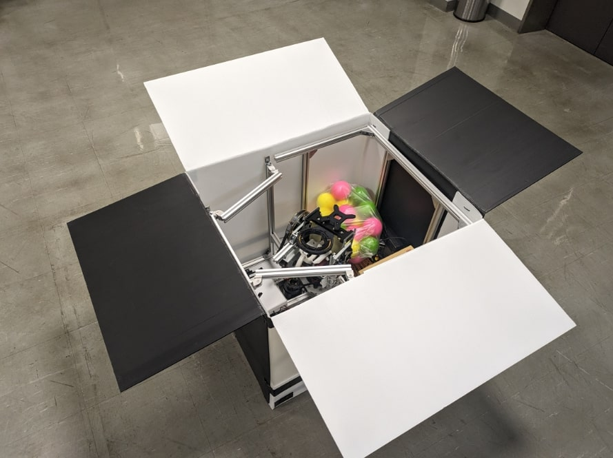
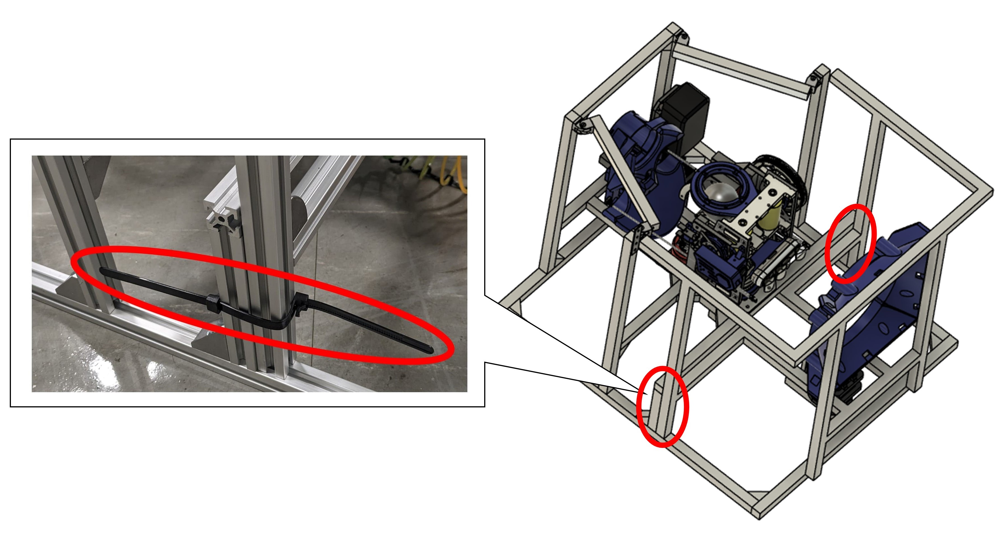

# CoRE Auto turret general
CoRE-1　オートタレットに関する情報をまとめています．
- [Raspberry Piのファームウェア](https://github.com/scramble-robot/CoRE_AutoRobot_2024_raspberrypi)
- [サンプルプログラム](https://github.com/scramble-robot/CoRE_AutoRobot_2024_sample)
- [CADデータ](https://a360.co/3MP85G7)

# SPEC
## サイズ
- 通常時
    - W550 *D670 *H1000


- 輸送時
    - W550 *D650 *H500




## 使用カメラ
- [Realsense D455](https://www.intelrealsense.com/depth-camera-d455/)
- ロボット視点イメージ

    [](https://www.youtube.com/watch?v=nvyRWckMJ-0)

## 使用Lidar
- [UST-30LX](https://www.hokuyo-aut.co.jp/search/single.php?serial=195)

## Pitch軸
- 可動域
    - +30deg～-10deg
- 駆動モータ
    - [GM6020](https://store.dji.com/jp/product/rm-gm6020-brushless-dc-motor?vid=48421)（ESC内蔵）
        - [データシート](https://www.mouser.com/datasheet/2/744/RoboMaster_GM6020_Brushless_DC_Motor_User_Guide-1551074.pdf)
    - タイミングベルトで1:3に減速
## Yaw軸
- 可動域
    - +80deg～-80deg
- 駆動モータ
    - [GM6020](https://store.dji.com/jp/product/rm-gm6020-brushless-dc-motor?vid=48421)（ESC内蔵）
        - [データシート](https://www.mouser.com/datasheet/2/744/RoboMaster_GM6020_Brushless_DC_Motor_User_Guide-1551074.pdf)
    - タイミングベルトで1:2に減速
## 射出ローラー
- 回転数
    - 0rpm～6500rpm（ルール上の制約により）
- 駆動モータ
    - [M3508](https://store.dji.com/jp/product/rm-m3508-p19-brushless-dc-gear-motor?vid=32501)（ESCに[C620](https://store.dji.com/jp/product/rm-c620-brushless-dc-motor-speed-controller?vid=32491)を使用）
        - [C620データシート](https://www.mouser.com/datasheet/2/744/RoboMaster_M3508_P19_Brushless_DC_Gear_Motor_V1.0-1551061.pdf)
    - 直径40mmのウレタンローラーを取付
## ボール撹拌，ボール送り出し
- [PWMサーボ](https://amzn.asia/d/aWBfjvF)

# 配布物一覧
## オートタレット一式
| 品名 | 数量 |
| -------- | -------- |
| オートタレット　| 1台 | 
| Raspberry Pi用ACアダプタ　| 1本 | 
| USB3.0 延長ケーブル　| 1本 | 
| PC-ロボット間通信用LANケーブル　| 1本 | 
| スイッチングハブ用電源アダプタ　| 1本 | 
| Greenworks 24V 電動工具用バッテリー　| 1個 | 
| バッテリー充電器　| 1個 | 
| MicroSDカード　| 1枚 | 
| 結束バンド　| 1袋 | 
| 六角レンチ4mm　| 1本 | 
| 撹拌機構　| 1個 | 
| 弾倉接続用パーツ　| 1個 | 
| 弾倉　| 1個 | 
| 撹拌機構取り付け用ネジ（M5*15）　| 8個 | 
| オートレフェリーユニット取り付け用ネジ（M5*10）　| 2個 | 
| ボール　| 50個（個数は変動する場合がございます） |
| ダメージパネル　| 1枚 | 
| ダメージパネル用モバイルバッテリー　| 1個 | 

## PC一式
- PCのパスワード
    - ユーザー名がscrambleの場合：core
    - ユーザー名がそれ以外の場合：ユーザー名と同じ
| 品名 | 数量 |
| -------- | -------- |
| デスクトップPC　| 1台 | 
| PC用電源ケーブル　| 1本| 

## オートレフェリーユニット（発送は遅れる場合があります）
| 品名 | 数量 |
| -------- | -------- |
| オートレフェリーユニット　| 1台 | 

# セットアップ手順
1. 下図の2個所のリピートタイを外し，上部フレームと下部フレームを分離させる．このとき外したリピートタイは後で使用する．

    **⚠️上部フレームがLidarにぶつかって破損しないように慎重に取り外すこと⚠️** 

    

1. 下図の6箇所のリピートタイを緩め，弾倉接続用パーツを取り外す．リピートタイは弾倉接続用に取り付けたままにする．

    

1. 下図に示す4個所のアルミフレーム用ナットを緩める．

    

1. 上部フレームと下部フレームを結合し，下図の4個所を六角レンチで締める．同時にサーボ用のコネクタを接続する．

    

1. 撹拌機構および弾倉接続用パーツを下図の8箇所でネジ止めする．同時にサーボ用のコネクタを接続する．

    

1. 結束バンドを下図に示す4個所に巻き付け撹拌機構のスプリングと砲塔を固定する．弾詰まりの原因となるため結束バンドの頭は必ずスプリングの外側に向けること．

    

1. プラダン製の弾倉を組み立て，1. で外したリピートタイを用いて下図に示す14箇所で固定する．

    

1. 下図2点でネジ止めしオートレフェリーユニットを取り付ける

    

1. [CoRE_AutoRobot_2024_raspberrypi](https://github.com/scramble-robot/CoRE_AutoRobot_2024_raspberrypi)に従ってRaspberry piをセットアップする．

1. [CoRE_AutoRobot_2024_sample](https://github.com/scramble-robot/CoRE_AutoRobot_2024_sample)に従って動作確認を行う．

# 発送時梱包手順
1. ジンバル，スイッチングハブ，回路，Lidar，バッテリーを緩衝材で梱包する．

1. 組み立て手順を逆順で行う．

    **⚠️分解の際にサーボのコネクタを外し忘れないように注意すること⚠️**

# タイミングベルトのテンション調整
下図に示す4個所のM5ボルトを緩め，モータが取り付けられている板金を引っ張ってテンションを調整する．


# ダメージパネルの発光色設定
[damagePanelDemo.ino](https://github.com/scramble-robot/CoRE_AutoRobot_2024_general/tree/main/damagePanelDemo)の8-11行目にある任意のLEDColorのコメントアウトを解除し，ダメージパネルに取り付けられたArduinoNanoに書き込む
```
/*------Set LED color------*/
uint32_t LEDColor= pixels.Color(255, 0, 0); //Red
//uint32_t LEDColor= pixels.Color(0, 0, 255); //Blue
//uint32_t LEDColor= pixels.Color(0, 128, 128); //Yellow
```